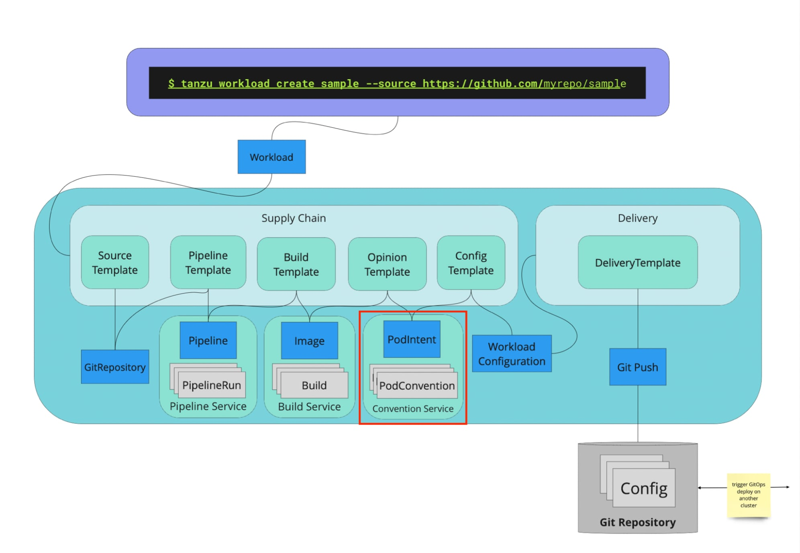
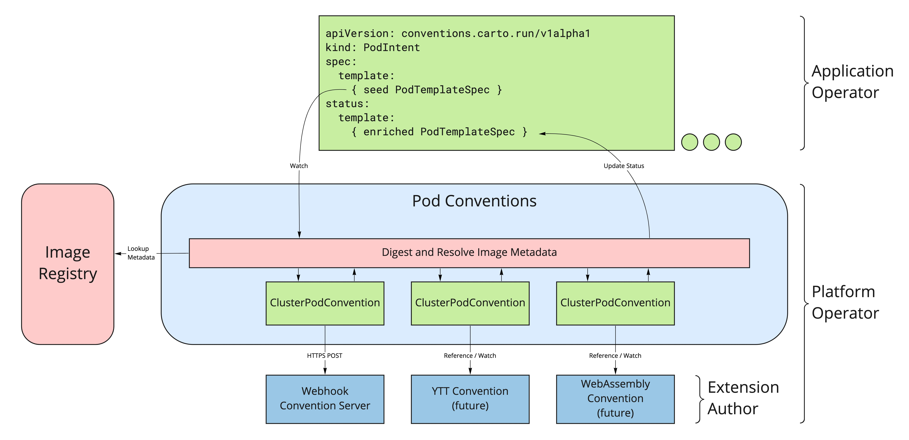

# Cartographer Conventions Design <!-- omit in toc -->

- [Overview](#overview)
  - [Key Terms and Concepts](#key-terms-and-concepts)
  - [Motivation](#motivation)
    - [Goals](#goals)
    - [Non-Goals](#non-goals)
    - [Assumptions](#assumptions)
  - [Roles](#roles)
- [Proposal](#proposal)
  - [Resources](#resources)
    - [PodIntent (conventions.carto.run/v1alpha1)](#podintent-conventionscartorunv1alpha1)
    - [ClusterPodConvention (conventions.carto.run/v1alpha1)](#clusterpodconvention-conventionscartorunv1alpha1)
    - [PodConventionContext (webhooks.conventions.carto.run/v1alpha1)](#podconventioncontext-webhooksconventionscartorunv1alpha1)
- [Lifecycle](#lifecycle)
  - [Security](#security)
  - [Supportability](#supportability)
- [Research](#research)

## Overview

Kubernetes as an infrastructure focused platform is able to run containerized workloads, but is missing knowledge of the application domain. An application-aware platform can extend the infrastructure platform adding application semantics to benefit both the application developer and application operator.

Application developers often focus on the domain logic of their workload, and are less focused on the operational specifics of running on Kubernetes. Application operators are focused on the runtime operation of the workload. Cartographer Conventions allows application developers to specify less in their deployment manifest, while giving operators more cross cutting control over how application workloads run within their platform.

We facilitate this by allowing operators to define conventions for how workload pods should run. The developer expresses the intent of their pod, handing that definition to the operator to apply operational knowledge and conventions. Often this operational knowledge is based on the content of the specific images being run. Cartographer Conventions codifies this operational knowledge to apply it to fleets of resources reducing the burden on application operators and increases the consistency of running workloads.

For example, Spring Boot workloads expose well-known endpoints to receive Kubernetes liveness and readiness probes. While these endpoints are well-known to developers, they are _not_ known to Kubernetes. A Spring Boot convention can detect when the image for a container uses Spring Boot and can configure an appropriate probe if one is not already defined. Similar conventions can be created for other popular frameworks.

Conventions can also be applied to all pod intents independent of the framework used. Each convention can decide both if and how it applies. For example, the user ID the container image specifies, could be updated within the pod template, so the other components of the system know the container isn't running as the root user.

We are starting specifically with conventions for Pods, with the potential to expand over time to support conventions for other types of resources.

### Key Terms and Concepts

#### Application Platform <!-- omit in toc -->

The broader set of environments, runtimes, and frameworks provided by a platform operator to application developers and application operators.

#### Application <!-- omit in toc -->

Logical grouping of workloads, data services and other components that create a system solving a business problem. All but the simplest applications will be composed of multiple workloads.

#### Convention <!-- omit in toc -->

Conventions adapt the intent provided by the application developer to act on behalf of the platform operator. Conventions should be used to reduce manual configuration and support best practices.

#### Intent <!-- omit in toc -->

The configuration defined by a user. Conventions are applied to the intent to produce an opinionated output.

#### Workload <!-- omit in toc -->

Container image-based deployment unit delivering specific value within a broader application that can be modeled with a Kubernetes [`PodTemplateSpec`](https://kubernetes.io/docs/reference/kubernetes-api/workload-resources/pod-template-v1/#PodTemplateSpec). Each application workload is deployed to a runtime that provides the lifecycle and environment for the workload. For example, a microservice is an application workload that is deployed with an HTTP application runtime, such as Knative Serving.

#### Workload Image <!-- omit in toc -->

An OCI Image referenced by a workload. Each image is typically built from source code that leverages a workload framework and may contain a language runtime.

#### Workload Framework <!-- omit in toc -->

A language specific programming model for developing workloads. For example, Spring Boot. The platform does not provide workload frameworks directly, but may have operational conventions for managing workloads written against the framework. Each application workload will typically use a single workload framework. Supporting a framework implies supporting the language ecosystem that framework depends on.

#### Workload Conventions <!-- omit in toc -->

Sensible defaults for how Kubernetes should operate a workload (typically built with a workload framework) on Kubernetes.

#### Workload Runtime <!-- omit in toc -->

The runtime semantics for an application workload. Each runtime can have dramatically different behavior and needs for the broader environment to satisfy. For example a web service needs to be scaled for incoming requests and exposed to ingress traffic, while a task runs to completion and then exits. Other workload runtimes may include batch and stream processing. Conventions are not directly aware of the runtime the workload will ultimately run with.

### Motivation

This section illuminates the reason(s) for this proposal as well as the proposal's goals, both in and out of scope. 

#### Goals

* Encourage convention-over-configuration for Kubernetes resources.
* Enable smooth, opinionated application developer experiences to be built on Kubernetes 
* Allow platform operators to extend the platform for application developers and operators by installing new conventions.
* No elevated permissions on the system. Normal access controls and guardrails are still in place.

#### Non-Goals

* Defining an application platform.
* Improve operational efficiencies by treating applications like cattle, including multi-tenancy densities and application-to-operator ratios. While conventions can aid this journey, it's not a complete story.
* Policy enforcement. Users can manipulate a resource after it has conventions applied before it is created.

#### Assumptions

* Cartographer Conventions is a component of an application platform, not an application platform on its own.
    * Opinionated developer experiences can be choreographed by platform operators to include Cartographer Conventions.
* The primary consumers of Cartographer Conventions are extension authors and platform operators, whose consumers are in turn application operators and application developers.
    * Application developers often take on the role of a platform operator, especially within a personal environment.
* Meaningful workload conventions can be defined for popular application frameworks that provide value without causing ill effects.
    * Framework developers and operators are interested and able to create new conventions.
    * Language ecosystems without strong frameworks (e.g. Node.js, Golang) will not have sufficient consistency or API hooks to define robust cross cutting conventions. Some simplified conventions are still likely possible.
* Images include sufficient metadata, like a bill of materials (SBOM), to make informed decisions about how the image should run on Kubernetes.
    * [Paketo Buildpacks](https://paketo.io) provide a good source of metadata.

### Roles

An individual may play multiple roles and those roles will vary based on the environment. For example, in a personal environment the same individual may take on each role, while in a production environment the roles are distinguished.

The following Roles are available:

#### Extension Author <!-- omit in toc -->

Defines new conventions that provide cross cutting value to all developers and operators on the platform.

#### Platform Operator <!-- omit in toc -->

Provides the application platform for developers. Sets organizational policies and guardrails for application developers. Typically manages infrastructure for a business unit or company wide. Manages the features exposed by the platform and is responsible for the overall health of the environment. Carries the pager for the platform.

#### Application Operator <!-- omit in toc -->

Manages the application in production, monitoring health, environment rollouts, provisions data services, and source code builds. Carries the pager for the application.

#### Application Developer <!-- omit in toc -->

A line of business engineer focused on delivering business value via custom code.

## Proposal

The workload `PodTemplateSpec` is decorated by the Cartographer Conventions as a series of conventions that enrich the workload based on the content of the `PodTemplateSpec` and metadata attached to the specific images contained therein. While the Cartographer Conventions does not directly create or own any resources, the enriched workload definition can then be deployed to a runtime resource, or captured into a gitops repository.

Increasingly images include a bill of materials expressing their content in a structured way. Images built with [Cloud Native Buildpacks](https://buildpacks.io), [Paketo](https://paketo.io) in particular, are rich in metadata describing their content. Cartographer Conventions resolves this metadata and provides it to the convention along with the workload's template.

For example, Spring Boot Actuator defines specific endpoints for Kubernetes liveness and readiness probes, but those values are not meaningful to non-Spring Boot workloads. A Spring Boot convention can detect that a workload image uses Spring Boot and enrich the container definition to provide richer defaults for the probes.

A common use for Cartographer Conventions is as a [ClusterConfigTemplate resource](https://cartographer.sh/docs/v0.2.0/reference/template/#clusterconfigtemplate) in a [Cartographer ClusterSupplyChain](https://cartographer.sh/docs/v0.2.0/reference/workload/#clustersupplychain). The supply chain is responsible for defining the `PodIntent` resource, often injecting the image that was built by another component. As new images or other configuration changes occur, Cartographer keeps the `PodIntent` up to date with the latest values. The `ClusterSupplyChain` is also responsible for watching the `PodIntent` for changes to its status so the enriched `PodTemplateSpec` can be consumed by yet another resource in the chain.

Example Cartographer supply chain orchestrating the Cartographer Conventions to deliver an application developer defined workload. This document is focused inside the red-highlighted box.



The core of Cartographer Conventions is defined by two concrete resources, the `PodIntent` and the `ClusterPodConvention`, and a controller to reconcile them.



### Resources

#### PodIntent (conventions.carto.run/v1alpha1)

`PodIntent` applies decorations to a workload [`PodTemplateSpec`](https://kubernetes.io/docs/reference/kubernetes-api/workload-resources/pod-template-v1/#PodTemplateSpec) exposing the enriched `PodTemplateSpec` on its status. No side effects are caused in the cluster other than updating the resources' status.

Each `PodIntent` is continuously reconciled. Conventions defined in the cluster are re-applied when a change is detected and resynchronized periodically. The owner of the `PodIntent` should watch the status for ongoing changes to the enriched `PodTemplateSpec`. Changes to a convention may not appear immediately, but will take effect during the next reconciliation of the `PodIntent`.

```yaml
---
apiVersion: conventions.carto.run/v1alpha1
kind: PodIntent
metadata:
  name: sample
spec:
  imagePullSecrets: <[]corev1.LocalObjectReference> # optional
  serviceAccountName: <string> # optional, defaults to 'default'
  template:
    <corev1.PodTemplateSpec>
status:
  observedGeneration: 1 # reflected from .metadata.generation
  conditions:
  - <metav1.Condition>
  template: # enriched PodTemplateSpec
    <corev1.PodTemplateSpec>
```

The `.spec.template` field defines the `PodTemplateSpec` to be decorated by conventions.

Platform operators can define conventions that have the opportunity to advise the workload. The OCI metadata/SBOMs for each image referenced is resolved and passed to each convention along with the latest `PodTemplateSpec`. Each convention can return a transformed `PodTemplateSpec` along with a list of conventions applied. A receipt of all applied conventions is stored under the annotation `conventions.carto.run/applied-conventions`. The annotation is managed centrally by the Cartographer Conventions and protected from manipulation by conventions.

Images hosted in a protected image registry can be pulled by either specifying image pull secrets directly on the `PodIntent`, or attaching the pull secret to a service account. The `default` service account is used by default. Implicit auth defined by the nodes via docker credential providers is also supported via [k8schain](https://pkg.go.dev/github.com/google/go-containerregistry/pkg/authn/k8schain).

The `Ready` condition is used to indicate all conventions applied to the `PodIntent` without error.

The enriched `PodTemplateSpec` is reflected at `.status.template`, which can be watched by the owner of the decorator, or referenced by another decorator to apply further decoration. The status' template is only updated when the `Ready` condition is `True`. The template contains the last good configuration, even if an error condition prevents new updates. The recency of the template can be determined by comparing `.status.observedGeneration` to `.metadata.generation`, when the values are the same, the template is fully up to date.

#### ClusterPodConvention (conventions.carto.run/v1alpha1)

Declares a webhook to apply conventions to enrich a `PodTemplateSpec`  based on its content and OCI metadata/SBOMs for each image. A convention will typically focus on support for a particular application framework, but may be cross cutting. Conventions should be idempotent and base decisions solely on the provided state.

```yaml
---
apiVersion: conventions.carto.run/v1alpha1
kind: ClusterPodConvention
metadata:
  name: sample
spec:
  selectors: # optional, defaults to match all workloads
  - <metav1.LabelSelector>
  webhook:
    clientConfig: 
      <admissionregistrationv1.WebhookClientConfig>
```

A label selector defined at `.spec.selectors` may be used for individual workloads to opt-in to a specific convention. The convention is applied if the `PodTemplateSpec`'s `.metadata.labels` match any of the selectors, or no selectors are defined.

At this time there is no `.status` object for the `ClusterPodConvention`. Since the resource is not itself reconciled there is nothing to write to the status. As we explore other mechanisms to define a convention that would require reconciliation, we will add status if appropriate.

As each `ClusterPodConvention` is processed, metadata for each image defined by the `PodTemplateSpec` is fetched as a [GGCR ConfigFile](https://pkg.go.dev/github.com/google/go-containerregistry@v0.8.0/pkg/v1#ConfigFile). Image metadata includes OCI defined values like env vars, exposed ports, labels and more. Labels in particular are a source of additional, rich metadata whose content is not defined by the OCI spec. Known SBOMs for the image are also resolved. At the moment this includes SBOMs contributed by Cloud Native Buildpacks. Other SBOM sources can be added in the future. There is no guarantee that an SBOM will be available, or in particular format. Tagged images are resolved to a digested reference in the resulting `PodTemplateSpec`.

While difficult to enforce centrally, well-behaved conventions have these characteristics:

* **Deterministic**: same inputs produces the same output
* **Idempotent**: equivalent to [`sideEffects: None`](https://kubernetes.io/docs/reference/access-authn-authz/extensible-admission-controllers/#side-effects).
* **Convergent**: reapplying the same convention sequentially should not change the result. Equivalent to [`reinvocationPolicy: IfNeeded`](https://kubernetes.io/docs/reference/access-authn-authz/extensible-admission-controllers/#reinvocation-policy).
* **Conservative**: preserve the user's intent. When a value is specified, favor keeping rather than replacing that value. In other words, a user should be able to override a convention by explicitly configuring the value.

Webhook based conventions are defined at `.spec.webhook` and are modeled after admission webhooks. The transport must be HTTPS with a trusted certificate matching the resolved host name. If the certificate is not already trusted by the cluster, the certificate authority must be specified at `.spec.webhook.clientConfig.caBundle`. A custom CA certificate may also be defined by referencing a cert-manager `Certificate` resource via the `conventions.carto.run/inject-ca-from` annotation with the value in the form of `{namespace}/{name}`.

#### PodConventionContext (webhooks.conventions.carto.run/v1alpha1)

The webhook request and response both follow this shape with the request defining the `.spec` and the response defining the `.status`. Unlike other resources, the `PodConventionContext` is used to communicate internally and does not exist on the Kubernetes API Server.

```yaml
---
apiVersion: webhooks.conventions.carto.run/v1alpha1
kind: PodConventionContext
metadata:
  name: sample # the name of the ClusterPodConvention
spec: # the request
  imageConfig: # one entry per image referenced by the PodTemplateSpec
  - image: ubuntu:bionic@sha256:122f506735a26c0a1aff2363<snip>
    config:
      <ggcrv1.ConfigFile>
    boms:
    - name: <name-or-filepath of sbom>
      raw: <[]byte>
  template:
    <corev1.PodTemplateSpec>
status: # the response
  appliedConventions:
  - my-convention # name of conventions applied
  template:
    <corev1.PodTemplateSpec>
```

In the future other mechanisms may be defined to provide conventions other than webhooks. In particular, mechanisms that are safe to execute within the controller process like a YTT overlay or WebAssembly. Each mechanism will define the specifics of its own contract similar in scope to the `PodConventionContext`.

## Lifecycle 

Cartographer Conventions lives entirely within the user space of a Kubernetes cluster. It can be installed, upgraded and removed like any other CRDs with a controller. Upgrade instructions will be included with each release.

During the alpha phase (v1alphaX) forwards and backwards compatibility is not be guaranteed. Upgrade paths between releases will be a good faith effort. We anticipate limited breaking changes during the alpha period.

### Security 

Conventions are implemented as webhooks that receive input state and return the opined state. TLS is used for the caller to verify a trusted server is responding, following the model for admission webhooks in the Kubernetes API Server.

The controller runs with a least privilege service account.

`PodTemplateSpec`s enriched by Cartographer Conventions are subject to the same guardrails and validation requirements of the runtime resources the output is copied to. Conventions have the same ability to define the `PodTemplateSpec` as someone directly creating the runtime resource.

Cartographer Conventions has no ability to view or directly modify runtime resources. It only has access to update resources within the `conventions.carto.run` API group, and view select other resources.

### Supportability 

MVP supportability includes common capabilities like rich logs, resource conditions, and events.  Conditions are used on Cartographer Conventions defined resources to signal errors and warnings. Every mutation to the Kubernetes API is logged with a diff before the request is made and a success/failure message after the call returns. The mutation success/failure is also recorded as a Kubernetes event.

Resources define open API structural schemas and where appropriate custom validation via admission webhooks.

## Research

Several application platforms were looked to for inspiration while defining this model. This is not an exhaustive list.

* raw [Kubernetes](https://kubernetes.io): dominates the infrastructure space. CRDs make extensions of the platform feel native. Cartographer Conventions is Kubernetes native.
* [Mutating Admission Webhooks](https://kubernetes.io/docs/reference/access-authn-authz/extensible-admission-controllers/): applies behavior to a resource when it is created or updated on the API Server before the change is accepted. Admission webhooks have a short timeout period and only trigger when an external client is making a mutation request to the API Server. The timeout and inability to react to external events (like image tag changes) make mutating admission webhooks a mismatched implementation choice. Mutating webhooks also mutates the resource as defined by the user, making it difficult to later apply new conventions by distinguishing the user's original intent from the current state of the resource.
* [Cloud Foundry](https://www.cloudfoundry.org): non-Kubernetes Platform as a Service. Provides a good developer and operator experience. Rigid in how apps are built, run and managed.
* [Mononoke](https://github.com/spring-cloud-incubator/mononoke): an early spike of application conventions binding to workloads.
